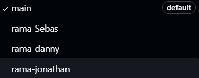
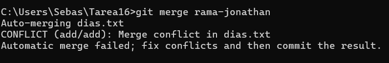
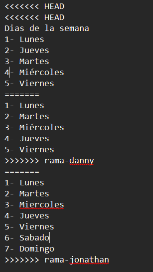

# Tarea 16: Trabajo Colaborativo y Control de Versiones

- Miembros del equipo:
  - Pincay Jonathan
  - Sebastián LLugsa
  - Lanchimba Danny

## Descripción
Este proyecto tiene como objetivo demostrar el uso de un sistema de control de versiones en un entorno colaborativo, utilizando Git como herramienta principal.

## Parte 1: Investigación Teórica

1. **¿Qué es un sistema de control de versiones y por qué es útil en proyectos colaborativos?**
   - Un sistema de control de versiones (VCS) te ayuda a llevar un registro de los cambios en el código, evitando que se pisen los avances de otros. Facilita ver los cambios, recuperar versiones anteriores y trabajar en equipo de manera más organizada.

2. **Explica los conceptos: repositorio, branch, merge y conflictos de código.**
   - **Repositorio**: Es como una carpeta donde se guarda todo el código y su historial. Puede estar en tu PC (local) o en línea (remoto) como en GitHub.
   - **Branch (rama)**: Es una copia del código para trabajar en nuevas funciones o correcciones sin afectar el código principal ("main" o "master").
   - **Merge (fusión)**: Es juntar los cambios de diferentes ramas en una sola, para integrar nuevas características o correcciones al código principal.
   - **Conflictos de código**: Ocurren cuando dos personas cambian lo mismo y Git no sabe qué versión usar. Se resuelven manualmente, eligiendo cuál conservar.

3. **¿Qué diferencia hay entre un sistema centralizado (SVN) y uno distribuido (Git)?**
   - En sistemas como SVN, hay un repositorio central al que todos se conectan para hacer cambios, lo que puede ser problemático si el servidor falla. Git, al ser distribuido, permite que cada desarrollador tenga su propia copia completa del repositorio en su máquina. Esto les deja trabajar sin conexión y probar cambios localmente antes de compartirlos. Además, Git ofrece más flexibilidad, permitiendo crear ramas y fusionar cambios de forma más fácil.

4. **Describe un flujo de trabajo típico con Git en un equipo (incluir creación de ramas, pull requests, y fusiones).**
   - Un flujo de trabajo típico con Git en equipo incluye los siguientes pasos:
     1. **Creación de ramas**: Cada miembro crea una nueva rama desde la principal para trabajar en nuevas funcionalidades o corregir errores.
     2. **Desarrollo**: Los desarrolladores hacen cambios en su rama y realizan commits explicando lo que modificaron.
     3. **Pull Requests**: Cuando los cambios están listos, el desarrollador crea un pull request para solicitar que su rama se fusione con la principal, permitiendo que otros revisen el código.
     4. **Revisión**: El equipo revisa el pull request, sugiere cambios o aprueba la fusión, mejorando así la calidad del código.
     5. **Merge (Fusión)**: Los cambios se integran a la rama principal, resolviendo conflictos si es necesario.
     6. **Despliegue**: Después de la fusión, el código se puede desplegar en producción o pruebas, según el flujo del equipo.
5. **Parte colaborativa.
    - Se creó un repositorio en  GitHub llamado: `Tarea16`.
   - Todos los miembros fueron añadidos como colaboradores.
  ### 2. Simulación de trabajo colaborativo

#### 📄 Ramas creadas
- `rama-Sebas`: sirvio para crear el archivo txt y agrego algunos de los dias de la semana en desorden.
- `rama-danny`: modifico el archivo txt para poner los dias de la semana en orden y agregar unos dias mas.
- `rama-jonathan`: agrego todos los dias de la semana y los ordeno

#### ✍️ Cambios realizados
- Rama `rama-Sebas`: creó un archivo `dias.txt` el cual contenia lo dias "Lunes", "Jueves y "Domingo". | Agrego una numeracion a la lista de los dias.
- Rama `rama-danny`: modifico el archivo y agrego el archivo agregando los dias "Miercoles" y "Viernes". | Ordeno los dias de la semana.
- Rama `rama-jonathan`: agrego los dias de la semana faltantes y ordeno los dias de la semana.

#### 🔀 Merge y resolución de conflictos
Durante la fusión de las ramas:
- Hubo conflictos en el archivo `dias.txt` entre `rama-Sebas` y `rama-jonathan`.
- El conflicto se resolvió de determinando que se debe agregar todos los dias de la semana en orden.
- Al final se modifico el archivo y se subio a la rama principal.

---

## 📘 Conclusiones
- Aprendimos cómo usar Git en equipo.
- Entendimos la importancia de escribir buenos mensajes de commit.
- Fue útil experimentar un conflicto y aprender a resolverlo.

---

## 📎 Repositorio
https://github.com/Sebastian84-m/Tarea16.git
